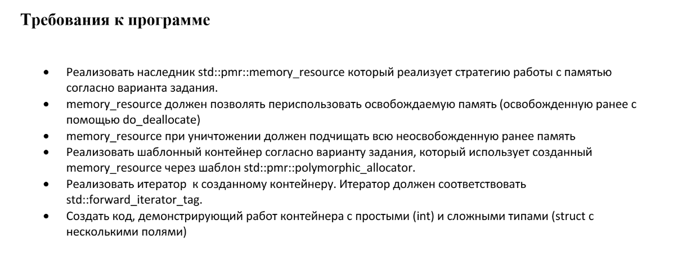

# mai_oop_lab_05
## Лабораторная работа №5. Дисциплина: ООП 

## Рыбин Владимир Викторович

## Вариант: 6

## Задание: 
- Стратегия работы memory_resource: 
Динамическое выделение памяти: для каждого объекта 
выделяется блок памяти на куче, информация о выделенных 
блоках сохраняется в std::map

- Контейнер: Динамический массив

## Требования 
